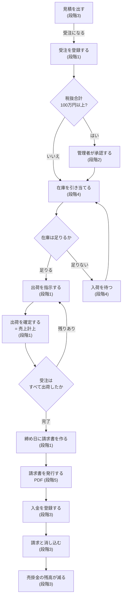
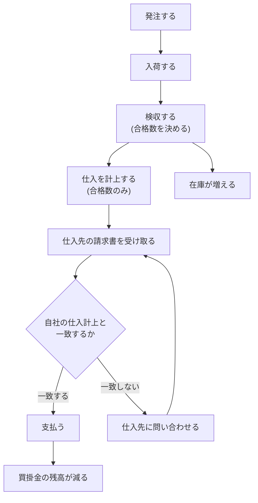
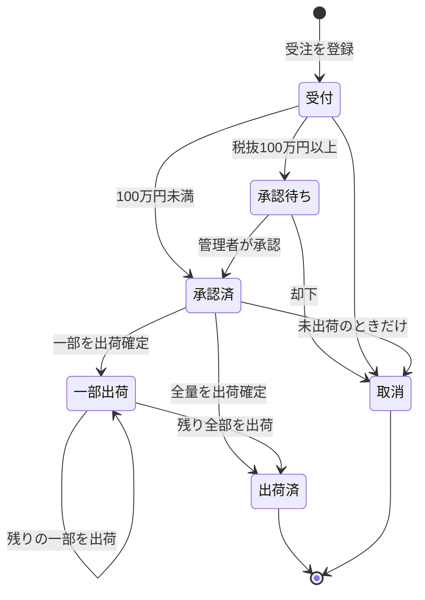
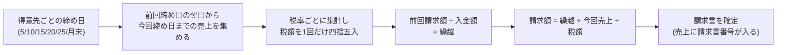

# 業務フロー

用語は`glossary.md`、判断の決まりは`business-rules.md`に従う。図の中の丸数字は段階（どの段階で作るか）。

## 1. 販売の流れ（受注から入金まで）

**分納**: 「出荷を確定する」から「受注はすべて出荷したか」で残りがあれば、再び出荷指示に戻る。受注明細の出荷済み数量で判定する。

## 2. 購買の流れ（発注から支払まで・段階4）

## 3. 受注の状態（段階1・承認は段階2）

**出荷済みの受注は取り消せない。** 出荷後に誤りが見つかった場合は、赤伝で打ち消す（`business-rules.md`の「締めた後に誤りが見つかったら」）。

## 4. 締めと請求（段階1）

**締め済みの売上は二重に請求しない。** 売上に請求書の参照が入っているかどうかで判定する。
