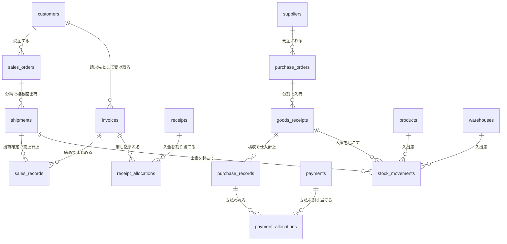
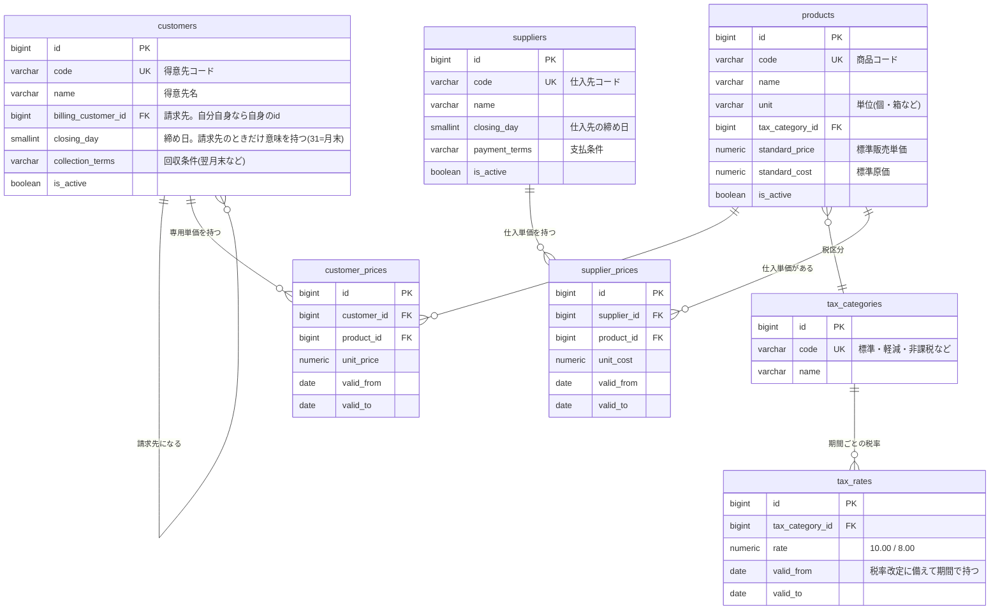
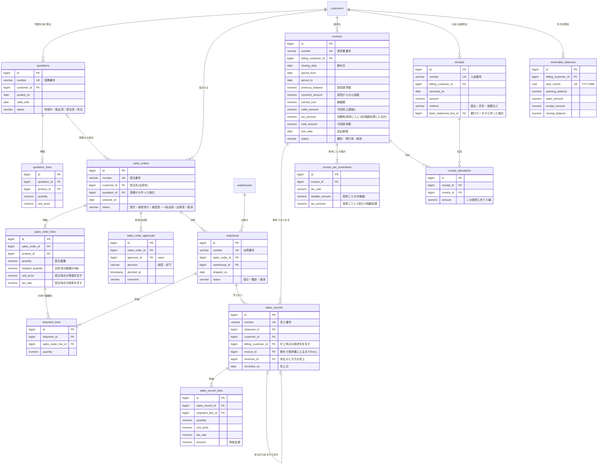
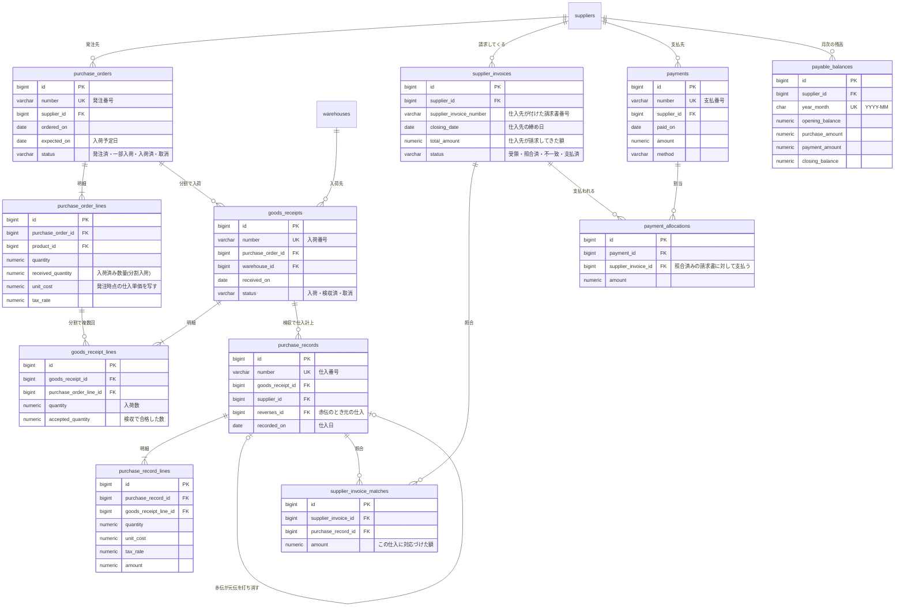
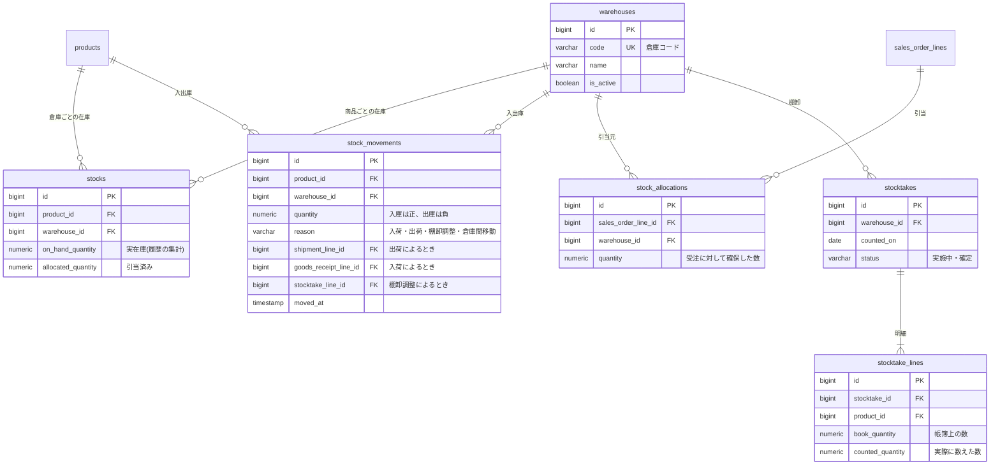
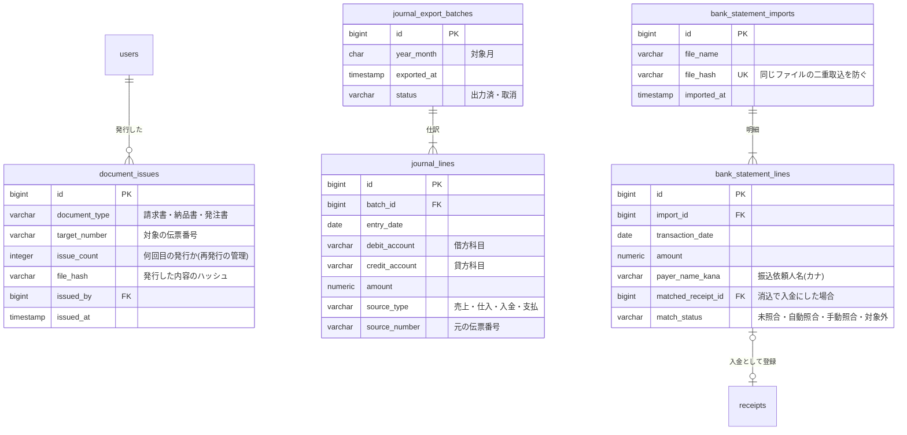
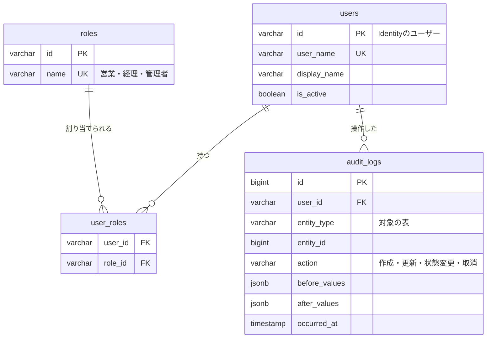

# ER図（販売・購買・請求の基幹システム）

全段階（1〜5）で使うテーブルの構造。**段階ごとに作るのは、その段階で使う表だけ**（先に全部は作らない）。各表の見出しに、作り始める段階を書いている。

- 図は領域ごとに分けている。領域をまたぐ関係は「0. 全体」で見る
- 属性は主キー（PK）・外部キー（FK）・一意キー（UK）と、業務上の要になる列だけを載せる。全列の定義はマイグレーションが正とする
- 型は仮置き。金額・数量の桁と端数処理は業務ルール集（`docs/domain/business-rules.md`、Day16で作成）で確定させる

## この形にした業務上の決定（2026-09-18）

| 論点 | 決定 | 構造への影響 |
|---|---|---|
| 請求の方式 | **締め請求**。出荷先と**請求先を分ける**（支店に出荷し、本社に請求する） | `customers`が請求先を自己参照する。請求書は請求先・締め日の単位で作る |
| 分納 | **あり**（1件の受注を複数回に分けて出荷する） | 受注明細に出荷済み数量を持ち、出荷明細が受注明細を参照する |
| 倉庫 | **複数** | 在庫を「商品×倉庫」で持つ |
| 販売単価 | **得意先別単価あり**（期間つき） | `customer_prices`。受注時の単価は受注明細に写して残す（後で単価表が変わっても過去の受注は変わらない） |

## 全表に共通する列（図では省略）

| 列 | 目的 |
|---|---|
| `created_at` / `created_by` / `updated_at` / `updated_by` | 誰がいつ作成・更新したか（`created_by`などは`users`への参照） |
| `row_version` | 楽観ロック（同時更新の衝突検知） |

**物理削除はしない。** マスタは`is_active`で無効化し、取引データ（受注・売上・請求・入金など）の取消は、状態の変更か**赤黒**（打ち消しの伝票を立てる）で表す。

---

## 0. 全体（領域をまたぐ主要な関係）

---

## 1. マスタ（段階1：得意先・商品・税率・倉庫／段階3：得意先別単価／段階4：仕入先）

倉庫は出荷が参照するので段階1で作る（1件だけ登録して使う。複数倉庫で在庫を動かすのは段階4）。段階1の受注は商品の標準単価を使い、得意先別単価は段階3で足す。受注明細は受注時点の単価を写すので、後から単価表を足しても過去の受注は変わらない。

---

## 2. 販売（段階1：受注・出荷・売上・請求／段階2：承認／段階3：見積・入金・消込・月次締め）

---

## 3. 購買（段階4）

---

## 4. 在庫（倉庫マスタのみ段階1、それ以外は段階4）

在庫の数は**入出庫の履歴（`stock_movements`）を正**とし、`stocks`はその集計を持つだけ（すぐ引けるように保持する写し）。数が合わなくなったら履歴から作り直せる。

---

## 5. 帳票と外部連携（段階5）

---

## 6. 権限と監査（段階1：監査ログ／段階2：ユーザー・役割）

ユーザーと役割はASP.NET Core Identityの表（`AspNetUsers`・`AspNetRoles`・`AspNetUserRoles`）を使う。ここでは業務側から参照する形だけを示す。

---

## 業務上の決定（2026-09-24・Day16で確定）

詳細は`business-rules.md`が唯一の定義元。構造に効くものだけをここに再掲する。

| 決定 | 構造への影響 |
|---|---|
| 金額は円単位、単価は小数2桁、数量は小数3桁 | `numeric(15,0)` / `numeric(15,2)` / `numeric(15,3)` |
| 端数は四捨五入。消費税は**税率ごとに1回だけ** | `invoice_tax_summaries`で税率ごとに持つ |
| 売上は**出荷基準**（出荷確定日に計上） | `sales_records.recorded_on`＝出荷確定日。検収の受け取りは持たない |
| 締め日は得意先ごとに選ぶ（5/10/15/20/25/月末） | `customers.closing_day` |
| 締め後の訂正は**翌月に赤黒** | `sales_records.reverses_id`。確定した請求書は変えない |
| 承認は税抜100万円以上（基準額は設定で持つ） | `sales_order_approvals` |
| **仕入先請求書と照合してから支払う** | `supplier_invoices`と`supplier_invoice_matches`を追加。支払は照合済みの請求書に割り当てる |

## まだ決めていないこと

- 値引き・返品の入力方法（赤黒で表す方針は決定済み）
- 与信限度額のチェック
- 倉庫間の在庫移動の承認
- 締め日を途中で変更した場合の扱い
